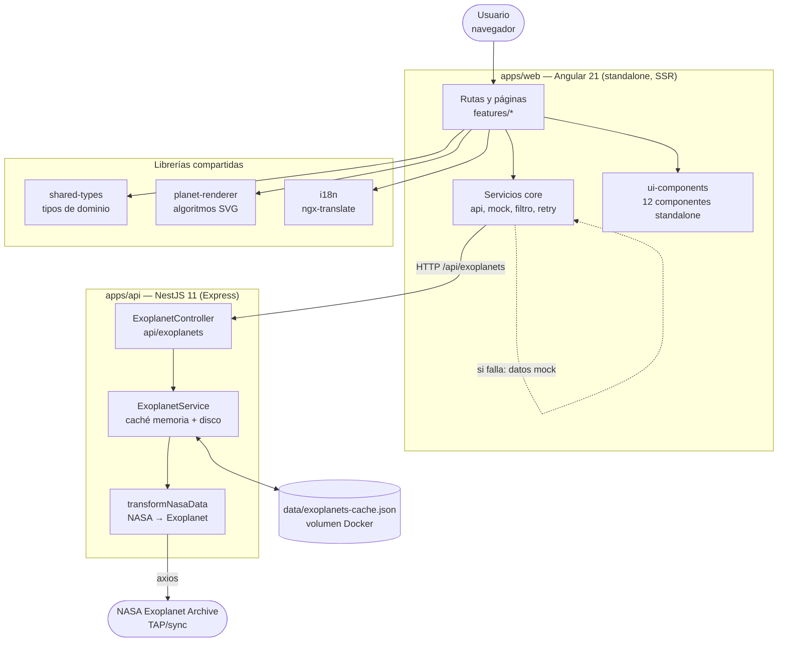

# ARCHITECTURE

Estado actual de `exodex`, derivado del código. No contiene planes ni decisiones pendientes: el
porqué vive en `docs/adr/`, el futuro en `openspec/changes/`.

## 1. Qué es

`exodex` es un visor web de exoplanetas. Consulta el archivo público de exoplanetas de la NASA
(NASA Exoplanet Archive, protocolo TAP), lo normaliza y lo publica como catálogo consultable con
filtros, ordenación, paginación y fichas de planeta y de sistema. Sin base de datos y sin usuario:
el catálogo completo cabe en memoria.

Monorepo **Nx 22.6.2** con dos aplicaciones y cuatro librerías.

## 2. C4 · Nivel 2 — Contenedores

Un nodo por proyecto del workspace. Los 8 proyectos están declarados en Nx y son las unidades reales
de compilación, test y despliegue.



| Contenedor | Tecnología | Responsabilidad |
|---|---|---|
| `apps/web` | Angular 21.2, standalone, SSR | UI, rutas, estado de filtros, llamada a la API y respaldo mock |
| `apps/api` | NestJS 11 sobre Express 4 | Endpoint de exoplanetas, caché y transformación del feed de la NASA |
| `apps/api-e2e` | Playwright 1.36 | E2E de la API, con `global-setup` que la levanta |
| `apps/web-e2e` | Playwright 1.36 | E2E de la web |
| `libs/shared-types` | TypeScript puro | Contrato de dominio compartido web ↔ API |
| `libs/planet-renderer` | TypeScript puro, buildable con esbuild | Algoritmos de render SVG de planeta y estrella |
| `libs/ui-components` | Angular 21, 12 componentes | Piezas visuales reutilizables |
| `libs/i18n` | ngx-translate 17 | Catalogo ES/EN y configuración del loader |

## 3. Dependencias entre paquetes

Las libs no se importan entre sí. Todas apuntan al mismo punto: `libs/shared-types`.

```
apps/web  ──> shared-types, planet-renderer, ui-components, i18n
apps/api  ──> shared-types
libs/ui-components ──> shared-types
```

Los alias (`@exodex/*`) se resuelven en `tsconfig.base.json`, no en el bundler: Nx compila cada
proyecto por separado y comparte el código fuente.

## 4. Flujo de datos de la API

1. `onModuleInit` dispara `loadData()` en segundo plano: el arranque no espera a la NASA.
2. `loadData()` busca `data/exoplanets-cache.json`. Si su antigüedad es menor que
   `DISK_CACHE_TTL_HOURS` (24 h por defecto), carga de disco y no sale a red.
3. Si no hay caché o está caducada, consulta NASA TAP y escribe la caché.
4. `onModuleInit` programa un `setInterval` de `CACHE_TTL_SECONDS` (3600 s) que repite el paso 2.
5. El transformer `transformNasaData` convierte la fila cruda de la NASA al tipo `Exoplanet`.
6. Sobre el array en memoria se construyen un `Map` por id y un índice de búsqueda invertido.

La capa de caché de filtros (`FILTER_CACHE_TTL_MS = 30_000`, `MAX_FILTER_CACHE_SIZE = 50`) vive en el
servicio y cachea combinaciones de filtros frecuentes, no solo en la respuesta.

## 5. Puntos de entrada

| Entrada | Fichero | Nota |
|---|---|---|
| Front | `apps/web/src/main.ts` | `bootstrapApplication` |
| API | `apps/api/src/main.ts` | `NestFactory.create(AppModule)`, gzip, CORS, puerto 3000 |
| Datos i18n | `libs/i18n/src/assets/i18n/{es,en}.json` | Se sirven como assets en `apps/web/public/assets/i18n/` |

## 6. Configuración

`apps/api` usa `ConfigModule.forRoot({ envFilePath: '.env', isGlobal: true })`. Todas las variables
del servidor se leen por `ConfigService`. El contrato completo está en `.env.example`:

| Variable | Default | Efecto |
|---|---|---|
| `PORT` | `3000` | Puerto de escucha |
| `CORS_ORIGIN` | `https://exodex.zemios.dev` | Origen único permitido |
| `NASA_TAP_BASE_URL` | endpoint TAP de la NASA | Fuente del catálogo |
| `DISK_CACHE_TTL_HOURS` | `24` | Vigencia de la caché en disco |
| `DISK_CACHE_PATH` | `./data/exoplanets-cache.json` | Ruta de la caché |
| `CACHE_TTL_SECONDS` | `3600` | Intervalo de re-chequeo en memoria |

## 7. Puertas de calidad

`nx build` (3 proyectos) en verde. `nx lint` (8 de 8) y `nx test` (5 de 5) tambien en
verde: 0 errores y 22 warnings de lint, y 223 tests repartidos en los 5 proyectos que
declaran target `test` (`planet-renderer`, `ui-components`, `shared-types`, `api`, `web`). El
detalle, con la clasificacion de cada fallo **historico** y el arreglo que se aplico, esta en
[`docs/operations/quality-gates.md`](docs/operations/quality-gates.md).

## 8. Despliegue

Tres `Dockerfile` conviven:

| Fichero | Imagen | Resultado |
|---|---|---|
| `Dockerfile` | Única | `node:22-alpine` + nginx + supervisor: web en 80, API detrás |
| `Dockerfile.api` | Separada | Solo la API, `node dist/apps/api`, expone 3000 |
| `Dockerfile.web` | Separada | Solo la web servida por nginx |

`docker-compose.yml` usa las dos separadas: web en `8089:80`, API en `3039:3000`, con volumen
`cache_data` montado en `/app/data` para que la caché sobreviva al reinicio.

Detalle operativo en [`docs/operations/deploy.md`](docs/operations/deploy.md).

## 9. Deuda técnica conocida

| Deuda | Dónde | Nota |
|---|---|---|
| Cero tests unitarios | todo el workspace | `nx test` falla por "no tests found" |
| `nx.json` sin `tags` | raíz | `@nx/enforce-module-boundaries` no puede clasificar las libs |
| Errores de lint sin arreglar | `planet-renderer`, `ui-components`, `web` | 43 errores, casi todos autofixables |
| i18n duplicado | `apps/web/public/assets/i18n/` y `libs/i18n/src/assets/i18n/` | 4 de los 8 clones de jscpd |
| Sin `ValidationPipe` | `apps/api` | Los DTO son `interface`/`type`, sin decoradores |
| `package.json` raíz sin scripts | raíz | Los comandos son targets Nx, no scripts npm |
| 2 `console.*` sin `Logger` en el front | `apps/web/src/main.ts`, `apps/web/src/app/core/services/exoplanet-api.service.ts` | **Angular 21 no exporta `Logger`.** Ver `docs/operations/quality-gates.md` |

## 10. Documentos relacionados

- [`docs/architecture/context.md`](docs/architecture/context.md) — C4 L1 + L2 en Mermaid
- [`docs/adr/README.md`](docs/adr/README.md) — decisiones y su deuda asumida
- [`docs/operations/quality-gates.md`](docs/operations/quality-gates.md) — estado y clasificación de las puertas
- [`CONTRIBUTING.md`](CONTRIBUTING.md) — cómo trabajar en este repo
