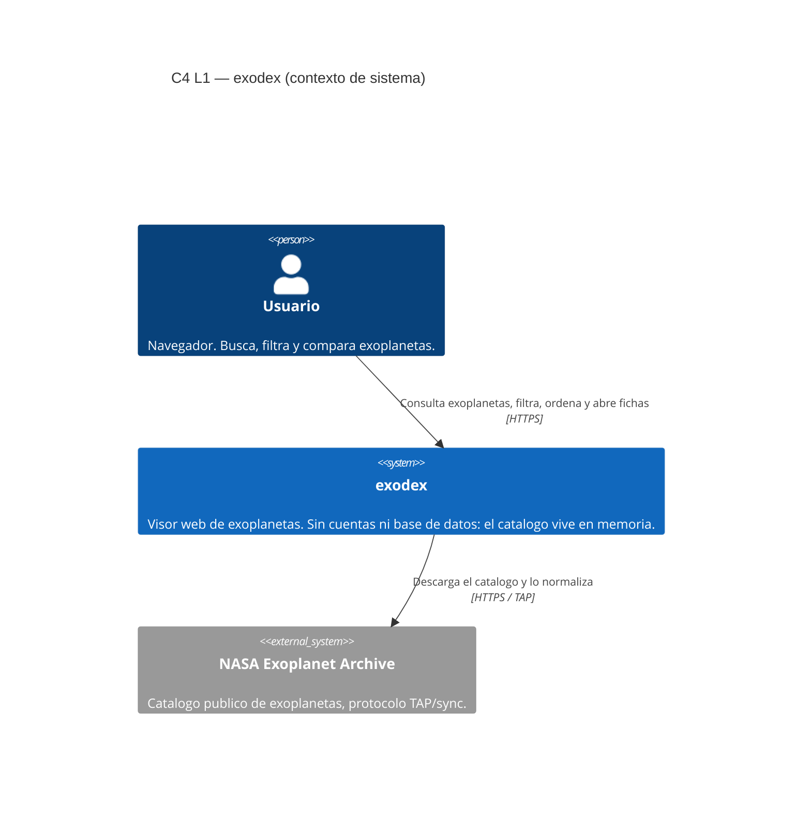
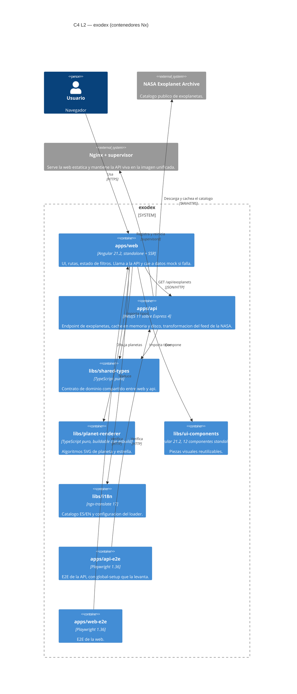

# Contexto de sistema

Vista **C4 nivel 1 (contexto)** y **nivel 2 (contenedores)** de `exodex`, en Mermaid para que
GitHub lo renderice sin tooling. El detalle por proyecto está en
[`ARCHITECTURE.md`](../../ARCHITECTURE.md).

## C4 · Nivel 1 — Contexto de sistema

`exodex` no expone nada más que HTTP de lectura. No tiene autenticación, no escribe y no tiene
estado entre peticiones: todo el estado es la caché en memoria y el fichero en disco.

## C4 · Nivel 2 — Contenedores

## Lectura del diagrama

- **Dos aplicaciones, cuatro librerías.** Las cuatro librerías se resuelven por alias
  `@exodex/*` declarados en `tsconfig.base.json`: Nx compila cada proyecto por separado y comparte
  el codigo fuente, no paquetes construidos.
- **Una sola direccion entre web y api.** La web consume la API; la API no conoce al front. El
  unico acoplamiento es el tipo `Exoplanet` de `libs/shared-types`.
- **La API es dueño de la cache.** La web no cachea el catalogo: si la API cae, `web` sirve datos
  mock desde `exoplanet-mock.service.ts` para que la interfaz siga siendo usable.
- **La NASA es la unica dependencia externa de datos**, y se consulta de forma diferida: el arranque
  no la espera. Un arranque lento o caido de la NASA degrada el servicio, no lo impide.

## Donde encaja cada fichero de configuracion

| Fichero | Papel en el diagrama |
|---|---|
| `nx.json` | Declara los plugins que infieren los targets `build`, `lint`, `test` y `e2e` |
| `tsconfig.base.json` | Define los alias `@exodex/*` que materializan las flechas entre contenedores |
| `apps/web/src/app/app.config.ts` | Ensambla providers de la web (router, HTTP, i18n, interceptores) |
| `apps/api/src/app/app.module.ts` | Ensambla `ConfigModule` global y `ExoplanetModule` |
| `docker-compose.yml` | Recorta los contenedores a dos servicios: `web` y `api` |
